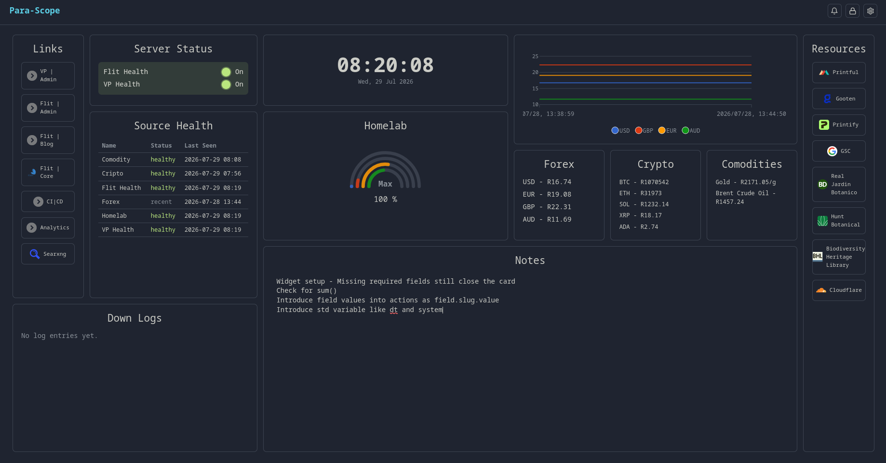

# Para-Scope

Self-hosted event hub and operational dashboard for personal or small-team infrastructure. Register **sources** (webhooks and/or scheduled polls), match events with **rules**, and run **actions** (update shared fields, notify, forward HTTP, browser push). A modular dashboard shows status, charts, clocks, and recent activity — without replacing Prometheus/Grafana or a full workflow engine like n8n.

- **Sources** — webhook receivers (HMAC, Stripe, GitHub, Slack, Discord, PayPal) and scheduled pollers
- **Pipeline** — event types → rules (with conditions) → actions
- **Fields** — shared logbook / value / text / toggle / data state for widgets and actions
- **Dashboard** — configurable widgets on `/`: time series, charts, displays, clocks, links, triggers, notes, and system views
- **Style** — themes, fonts, and custom background images at `/config/style`
- **Ops views** — `/events`, `/system`, plus config for users, dashboard layout, and audit log
- **Simple ops** — single-process FastAPI + SQLite; no Docker required

In-app detail: **Help** at `/help` after login. Contributor recipes for pollers, actions, and widgets: [docs/authoring.md](docs/authoring.md).

[Landing Page](https://para-scope.bmd-studios.com)



## Requirements

- Python 3.11+
- [`uv`](https://github.com/astral-sh/uv) (or pip + venv)
- For production: systemd and nginx (optional TLS via certbot)

## Quick Start

```bash
uv venv .venv && uv pip install -r requirements.txt -p .venv
source .venv/bin/activate
cp .env.example .env   # then set PARA_SCOPE_SECRET_KEY (see Environment)
uvicorn app.main:app --reload
```

Open http://localhost:8000. The first start creates SQLite `para_scope.db` in the project root. With no users yet you are sent to `/setup` to create the first account; after that, use `/login`.

For headless installs (after the app has created the DB once):

```bash
python create_user.py
```

## Environment

Copy `.env.example` to `.env` (gitignored). Values are loaded automatically via `python-dotenv`.

| Variable | Required | Description |
|----------|----------|-------------|
| `PARA_SCOPE_SECRET_KEY` | Yes | Signs session cookies and encrypts stored secrets (Fernet). The app **refuses to start** if unset. Generate with `openssl rand -hex 32`. |
| `PARA_SCOPE_SECURE_COOKIES` | No | Set to `1`/`true`/`yes` so session and CSRF cookies use the `Secure` flag (use behind HTTPS). |
| `PARA_SCOPE_DATABASE_URL` | No | SQLite SQLAlchemy URL only. Default: `para_scope.db` in the project root. PostgreSQL support is not planned. |
| `PARA_SCOPE_LOG_LEVEL` | No | Logging level (default `INFO`). |
| `PARA_SCOPE_UPLOADS_DIR` | No | Directory for uploaded dashboard backgrounds (default `data/uploads`). |
| `PARA_SCOPE_VAPID_PUBLIC_KEY` | No | Web Push VAPID public key (required for `web_push` actions). |
| `PARA_SCOPE_VAPID_PRIVATE_KEY` | No | Web Push VAPID private key. |
| `PARA_SCOPE_VAPID_SUBJECT` | No | VAPID subject (`mailto:`…); defaults to `mailto:admin@localhost`. |
| `PARA_SCOPE_ALLOW_LOCAL_ACTIONS` | No | Set to `1`/`true`/`yes` to allow `local_script` pipeline actions. |
| `PARA_SCOPE_LOCAL_ACTION_ALLOWLIST` | No | Optional colon-separated path prefixes / exact paths for the script binary (`argv[0]`). |

## How to

Get a working pipeline after login (more detail in `/help`):

1. **Open Pipeline** at `/config/pipeline`. Add a source (name required; slug is always derived from the name). Choose type **Webhook** (optional provider + secret in the same dialog) or **Poll** (initial schedule required). Poll sources get `on_success` and `on_failure` events automatically (no auto-rules).
2. **Add event types** on the source chain (Source → Event Types → Rules). New webhooks already include `always`. Once a source has producer types, webhooks must declare a matching type via the `X-Event-Type` header (or `X-GitHub-Event`), or body field `event_type` / `type`. Matching is case-insensitive; types are stored lowercase.
3. **Ingest an event** — pick one path:
   - **Webhook:** `POST /webhook/{slug}` with a JSON body (see [Webhooks](#webhooks)).
   - **Poll:** schedules feed `on_success` / `on_failure` into the same pipeline (see [Polling](#polling)).
4. **Add a rule** for the event(s) you care about (use **Add rule** on an event row to pre-select it). Empty conditions match all events for those types.
5. **Add an action on that rule** (`field_push` is a good smoke test; `http_forward`, `notify` for ntfy / Gotify / Discord, and `web_push` are also built in; `local_script` needs `PARA_SCOPE_ALLOW_LOCAL_ACTIONS=1`). Optional credentials can be attached in the action dialog. For `web_push`, set VAPID env vars and click the bell in the header to enable notifications. Events, rules, and actions are editable from the chain.
6. **Confirm** on `/events` (live SSE tail), enable widgets at `/config/dashboard`, and view them on `/`. Widget **titles**, **labels**, **units**, and **link URLs** accept `{{ slug… }}` Field templates at display time (same bare-slug namespace as display templates; notes stay literal).

Day-to-day: `/events` and `/system`. Manage accounts at `/config/users`. Appearance and dashboard background: `/config/style`.

## Webhooks

`POST /webhook/{slug}` accepts JSON (max body 256KB). Accepted deliveries return **202**. Provider-specific verification is listed under [Capabilities](#webhook-providers). For **generic HMAC**, requests must include `X-Webhook-Timestamp` (unix seconds) and `X-Webhook-Signature` = HMAC-SHA256 of `{timestamp}.{raw_body}` (hex, optional `sha256=` prefix). Sources without a secret accept unsigned traffic (fine for local/dev; use a secret in production).

The webhook URL is your Para-Scope origin plus the source path, e.g. `https://para.example.com/webhook/warehouse-sensors`. The slug is derived from the source name and shown on the source edit dialog and on `/system`. Renaming a source re-derives its slug and therefore changes the URL — update your senders if you rename one.

```bash
curl -X POST https://para.example.com/webhook/warehouse-sensors \
  -H 'Content-Type: application/json' \
  -H 'X-Event-Type: status.changed' \
  -d '{"door": "open"}'
```

### Event types

You do not invent event types — you copy them from the sender. Values are stored **lowercase** (punctuation preserved); matching is case-insensitive (`Order.Paid` matches `order.paid`). Providers that send uppercase (e.g. PayPal `PAYMENT.SALE.COMPLETED`) match when registered as `payment.sale.completed`.

Para-Scope reads the type from the first of these that is non-empty:

1. the `X-Event-Type` header
2. the `X-GitHub-Event` header (GitHub / Gitea)
3. the JSON body field `event_type`
4. the JSON body field `type`

Discord is a special case: its numeric interaction `type` is mapped to `application_command`, `message_component`, `application_command_autocomplete`, or `modal_submit`.

What happens on delivery depends on which **producer** types the source has registered (`always` does not count as a producer type):

| Registered on the source | Delivery declares | Result |
|---|---|---|
| One or more producer types | a matching type | 202, typed event (+ `always` side-emit if present) |
| One or more producer types | an unknown type | 400 `Event type '<name>' not found for source` |
| One or more producer types | nothing | 400 `Event type required`, with the registered types listed |
| Nothing, or only `always` | nothing, or an unmatched body `type` | 202, event stored untyped (+ `always` side-emit if present) |

New webhook sources are seeded with `always`. With only `always`, a payload’s generic top-level `type` field does not block discovery — the delivery is accepted untyped so you can inspect it, then register the producer type you need.

**Finding the right type:** check the sender's documentation (Stripe `checkout.session.completed`, GitHub's `X-GitHub-Event` value, PayPal `PAYMENT.SALE.COMPLETED`), or inspect an untyped sample with **Recent**. Register the lowercase form.

Senders never send `always`; Para-Scope emits it alongside the normal event with `_webhook.trigger` set to `always` and `_webhook.event_type` set to the producer type (or `null` when untyped).

Public health check: `GET /health`.

## Polling

Set the schedule when you create or edit a **Poll** source (exactly one schedule per poll source: interval, cron, or never / trigger-only). Full subtype inventory is under [Capabilities](#pollers).

Jobs run in-process via APScheduler and feed the same pipeline as webhooks. Use **Run now** on a poll source to fire immediately.

Successful polls emit `on_success` by default; failures emit `on_failure`. Some pollers also let you set a different success event type. If you add an event type named `always` (not created automatically), it also fires on every poll run.

### Poll privileges

Para-Scope does **not** need to run as root by default. The normal production setup is:

- run the app as a dedicated `parascope` service user
- grant that user only the filesystem and group access needed for the pollers you actually configure

For the shipped pollers:

- **Usually fine as an unprivileged service user:** HTTP / APIs, DNS, TCP connect, TLS cert expiry, RSS / Atom, IMAP, domain expiry, Home Assistant, local LLM HTTP status, database health, system snapshot, disk free space, backup age, git status
- **May need extra read access:** log pattern watch, backup age on restricted paths, disk free space on restricted mount points
- **May need host group access:** `journal_recent_errors` often needs membership in `systemd-journal` or `adm` (distro-dependent) so `journalctl` can read the system journal
- **Usually works unprivileged, but still depends on host policy:** `systemd_failed_units` (it shells out to `systemctl`); `icmp_ping` may need ping capability or network policy that allows ICMP from the service user

Highest reasonable privilege for the shipped pollers is usually **a dedicated service user with a minimal supplemental group set and/or ACLs on the monitored paths**, not root.

## Capabilities

### Dashboard widgets

Configure layout at `/config/dashboard`. Widgets bind to Fields (or stand alone) and refresh with the dashboard.

| Kind | Displays | Notable styles |
|------|----------|----------------|
| **Time series** | Line, area, column | Basic, labels, multi-series, stepline, stacked, stacked 100%, negative values |
| **Chart** | Pie / donut, radial / gauge, radar, polar area | Needle gauge, ticks, gradient, multi-band, custom angle |
| **Display** | Logbook list, key / text, toggle, board, table | LED / badge / switch toggles; timeline or card logbooks; striped tables |
| **Clock** | Digital, analog, compact, world clocks | Mono / callout digital; ring analog; list or card world clocks |
| **Links** | List, button row, icon grid | Default, compact, emphasized |
| **Notes** | Text | Freeform notes on the board |
| **System** | Source health, recent events, poll status, metric summary | Table, compact, or cards |

Time series and charts use ApexCharts. Series pull numeric history from logbook Fields (with optional value paths and transforms).

### Pollers

**Poll** sources run exactly one subtype on an **interval** or **cron** schedule (APScheduler, in-process). Choose a category, then a subtype. Successful polls emit `on_success` (or a subtype-specific success type); failures emit `on_failure`. An optional `always` event type also fires on every run. Use **Run now** to fire immediately.

HTTP / API pollers support Bearer, HTTP Basic, and OAuth2 client-credentials auth via encrypted secrets.

| Category | Subtypes |
|----------|----------|
| **HTTP / APIs** | `http_get` (GET / HEAD), `http_post`, `http_put`, `http_delete` |
| **Host / OS** | `system_snapshot`, `systemd_failed_units`, `journal_recent_errors` |
| **Network / DNS / TLS** | `tcp_connect`, `icmp_ping`, `dns_resolve`, `cert_expiry` |
| **Files / Backups** | `disk_free_space`, `backup_age` |
| **Local Apps / Data** | `git_status`, `database_health`, `log_pattern_watch`, `home_assistant_snapshot`, `local_llm_http_status` |
| **External Services** | `rss_atom_change`, `imap_unread`, `domain_expiry` |

Use generic HTTP pollers for plain endpoint checks. Prefer specialized subtypes when they add real integration behavior (feed change detection, Home Assistant states, IMAP unread counts, whois expiry, and so on).

### Fields

| Type | Purpose |
|------|---------|
| **Logbook** | Growing list of entries (capped); drives series graphs and recent-activity widgets |
| **Value** | Numeric state — actions can add, subtract, set, or reset |
| **Text** | Single text value from a template |
| **Toggle** | On / off — actions can set fixed or switch |
| **Data** | Structured JSON blob for templates and displays |

### Actions

| Action | What it does |
|--------|----------------|
| **Update field** (`field_push`) | Write to a Field from the event payload / templates |
| **Call URL** (`http_forward`) | HTTP request to another service |
| **Notify** | ntfy, Gotify, or Discord (thin wrapper over Call URL) |
| **Browser notification** (`web_push`) | Web Push via VAPID (bell in the header to subscribe) |
| **Trigger source** (`trigger_source`) | Run a poll once or ingest a webhook event type (nested cascades capped at depth 3) |
| **Local script** | Run a host command (requires `PARA_SCOPE_ALLOW_LOCAL_ACTIONS=1`; optional path allowlist) |

### Webhook providers

`POST /webhook/{slug}` accepts JSON (max body 256KB). Choose a verification provider per source:

- **Generic HMAC** — `X-Webhook-Timestamp` + `X-Webhook-Signature` (HMAC-SHA256 of `{timestamp}.{raw_body}`)
- **Stripe** — Stripe signature header (+ timestamp skew)
- **GitHub** — GitHub / Gitea webhook secret (body HMAC; no timestamp in the protocol — replay protection is the in-memory cache TTL only)
- **Slack** — Slack signing secret (+ timestamp skew)
- **Discord** — Ed25519 application public key (+ timestamp skew)
- **PayPal** — PayPal verify-webhook-signature API

Sources without a secret accept unsigned traffic (fine for local/dev; use a provider secret in production).

## Production (VM + systemd + nginx)

Run a **single** uvicorn worker. Rate limits and the poll scheduler are in-process; multiple workers would split that state incorrectly. Bind uvicorn to localhost and put nginx in front for TLS and public access.

This section assumes a small Linux VM (Debian/Ubuntu-style layout), a DNS name such as `para.example.com`, and systemd + nginx on the host.

### 1. VM prep

Create the VM, point DNS at it, then install the base packages you need:

```bash
sudo apt update
sudo apt upgrade -y
sudo apt install -y git curl nginx certbot python3-certbot-nginx
```

Install `uv` if it is not already present:

```bash
curl -LsSf https://astral.sh/uv/install.sh | sudo env UV_INSTALL_DIR=/usr/local/bin sh
```

Recommended host checklist:

- open inbound `80/tcp` and `443/tcp` (plus `22/tcp` for SSH)
- create an `A` / `AAAA` record for your VM before running certbot
- use a real sudo-capable admin account for provisioning; do **not** run the app itself as that account

### 2. Create the service user and app directory

```bash
sudo useradd --system --create-home --home-dir /opt/para-scope --shell /usr/sbin/nologin parascope
sudo mkdir -p /opt/para-scope
sudo chown parascope:parascope /opt/para-scope
```

### 3. Optional host access for pollers

Start least-privileged and add only what you need:

```bash
# journal access on many distros (pick the group your distro uses)
sudo usermod -aG systemd-journal parascope
# or
sudo usermod -aG adm parascope
```

For log files, backup directories, or repositories outside `/opt/para-scope`, prefer group ownership or ACLs over running the service as root:

```bash
# example: allow parascope to read a specific log tree
sudo setfacl -R -m u:parascope:rx /var/log/myapp
sudo setfacl -R -d -m u:parascope:rx /var/log/myapp
```

Notes:

- `journal_recent_errors` may need journal-reading group access
- `backup_age`, `disk_free_space`, `log_pattern_watch`, and `git_status` only work where the service user can traverse/read the target paths
- root is **not** the recommended default, even for system/storage polls

### 4. Install the app

Run the app install steps as the `parascope` user:

```bash
sudo -u parascope -H bash -lc '
set -e
cd /opt/para-scope
git clone <your-repo-url> .
uv venv .venv
uv pip install -r requirements.txt -p .venv
cp .env.example .env
'
```

Then edit `/opt/para-scope/.env` and set at minimum:

```dotenv
PARA_SCOPE_SECRET_KEY=<openssl rand -hex 32>
PARA_SCOPE_SECURE_COOKIES=1
PARA_SCOPE_LOG_LEVEL=INFO
```

Generate the secret key with:

```bash
openssl rand -hex 32
```

### 5. systemd unit

Create `/etc/systemd/system/para-scope.service`:

```ini
[Unit]
Description=Para-Scope event dashboard
After=network.target

[Service]
Type=simple
User=parascope
Group=parascope
WorkingDirectory=/opt/para-scope
EnvironmentFile=/opt/para-scope/.env
ExecStart=/opt/para-scope/.venv/bin/uvicorn app.main:app --host 127.0.0.1 --port 8000 --workers 1
Restart=on-failure
RestartSec=5
NoNewPrivileges=true
PrivateTmp=true

[Install]
WantedBy=multi-user.target
```

Enable and start:

```bash
sudo systemctl daemon-reload
sudo systemctl enable --now para-scope
sudo systemctl status para-scope
sudo journalctl -u para-scope -f
```

### 6. nginx reverse proxy

Example site config (replace `para.example.com`). `client_max_body_size` is sized for Style background uploads (app limit 5 MB); webhook bodies stay capped at 256 KB in the app.

```nginx
server {
    listen 80;
    server_name para.example.com;

    client_max_body_size 8m;

    location / {
        proxy_pass http://127.0.0.1:8000;
        proxy_set_header Host $host;
        proxy_set_header X-Forwarded-For $proxy_add_x_forwarded_for;
        proxy_set_header X-Forwarded-Proto $scheme;
        proxy_set_header X-Forwarded-Host $host;
        proxy_set_header X-Real-IP $remote_addr;
        proxy_http_version 1.1;
        proxy_set_header Connection "";
    }

    # Live event tail (SSE) — disable buffering and keep the connection open.
    location /events/stream {
        proxy_pass http://127.0.0.1:8000;
        proxy_set_header Host $host;
        proxy_set_header X-Forwarded-For $proxy_add_x_forwarded_for;
        proxy_set_header X-Forwarded-Proto $scheme;
        proxy_set_header X-Forwarded-Host $host;
        proxy_set_header X-Real-IP $remote_addr;
        proxy_http_version 1.1;
        proxy_set_header Connection "";
        proxy_buffering off;
        proxy_cache off;
        proxy_read_timeout 1h;
    }
}
```

Save it as `/etc/nginx/sites-available/para-scope`, then enable and validate it:

```bash
sudo ln -s /etc/nginx/sites-available/para-scope /etc/nginx/sites-enabled/
sudo nginx -t && sudo systemctl reload nginx
```

Then obtain TLS (certbot will adjust the server block):

```bash
sudo certbot --nginx -d para.example.com
```

### 7. First start and first login

Confirm the local app is reachable through nginx:

```bash
curl -I http://127.0.0.1:8000/health
curl -I https://para.example.com/health
```

Then open `https://para.example.com/setup` and create the first user.

For headless installs, first make sure the app has started once so the DB exists, then run:

```bash
cd /opt/para-scope
source .venv/bin/activate
python create_user.py
```

### 8. Ongoing operations

- App logs: `sudo journalctl -u para-scope -f`
- Restart after upgrades or env changes: `sudo systemctl restart para-scope`
- Reload nginx after config changes: `sudo nginx -t && sudo systemctl reload nginx`
- Health check: `GET /health`

### 9. Upgrade flow

```bash
sudo systemctl stop para-scope
sudo -u parascope -H bash -lc '
set -e
cd /opt/para-scope
git pull --ff-only
uv pip install -r requirements.txt -p .venv
'
sudo systemctl start para-scope
sudo systemctl status para-scope
```
